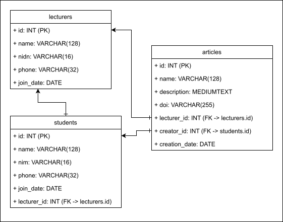

# Tugas Praktikum DPBO #8

Dibuat untuk menyelesaikan TP8 Desain Pemrograman Berorientasi Objek (DPBO)

## Janji

Saya Willsoon Tulus Parluhutan Simanjuntak dengan NIM 2404756 mengerjakan evaluasi Tugas Praktikum 8 dalam mata kuliah Desain Pemrograman Berorientasi Objek untuk keberkahanNya maka saya tidak melakukan kecurangan seperti yang telah dispesifikasikan. 

Aamiin.

## Desain program

Program ini merupakan program CRUD berbasis antarmuka web dengan arsitektur Model-View-Controller (MVC) berbasis PHP beserta basis data PHP Data Objects untuk mengelola artikel yang dipublikasikan, beserta dosen dan mahasiswa yang terkait.

### Diagram UML (Basis Data):

### Deskripsi desain basis data:

- Tabel `lecturers` menampung data dosen yang berupa ID, nama, NIDN, nomor telepon, dan tanggal pendaftaran.
- Tabel `students` menampung data mahasiswa yang berupa ID, nama, NIM, nomor telepon, tanggal pendaftaran, dan ID dosen wali.
- Tabel `articles` menampung data artikel yang berupa ID, nama, deskripsi, DOI, ID mahasiswa, ID dosen pengampu, dan tanggal pembuatan artikel.

## Alur jalan program

Program ini menyediakan antarmuka berupa webpage yang bisa dibuka oleh user (misal: manager kumpulan artikel publikasi universitas) 

## Preview operasional program

